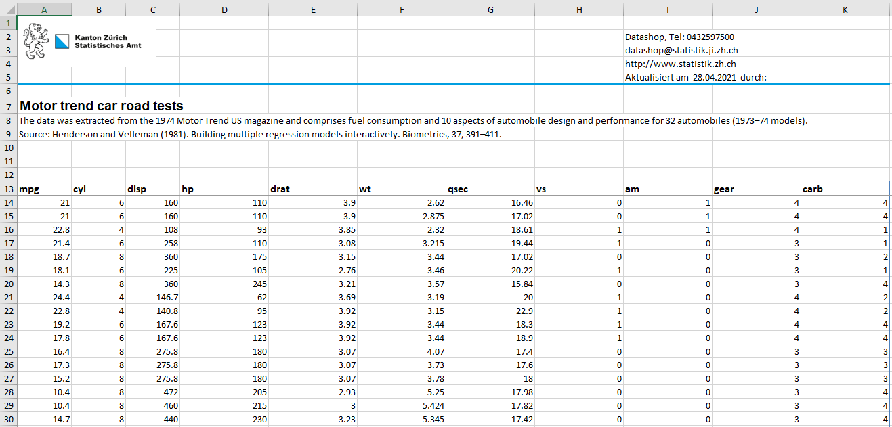
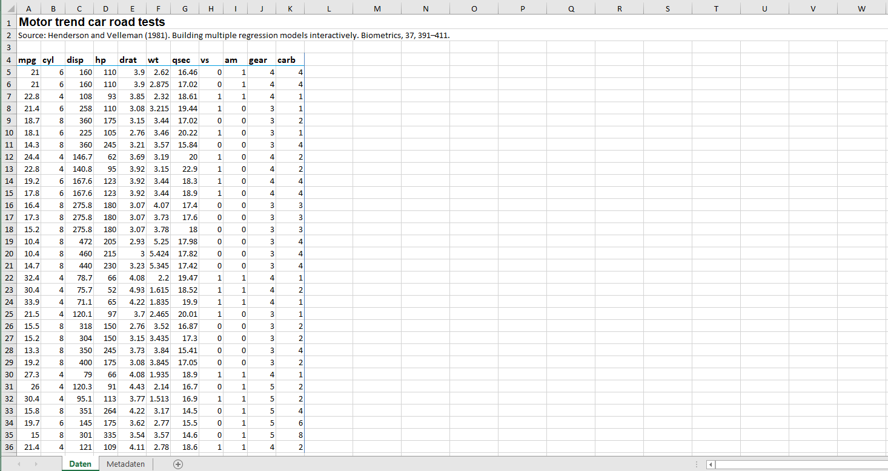
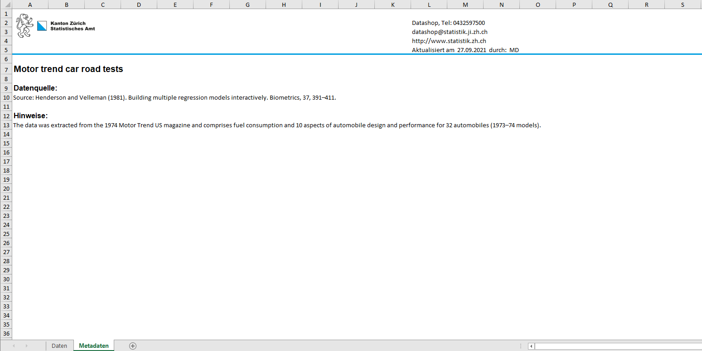
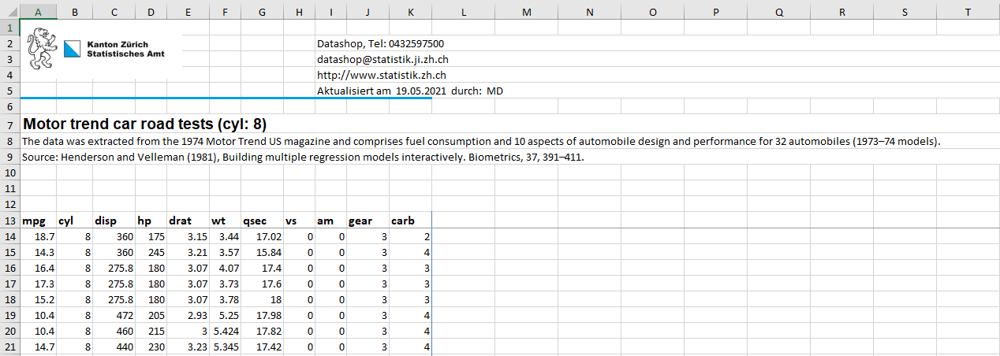

```{r, include = FALSE}
knitr::opts_chunk$set(
  collapse = TRUE,
  comment = "#>"
)
```

## Allgemeine Informationen

`statR` enthält mehrere Funktionen, mit welchen Datensätze aus `R` als 
Excel-Dateien exportiert werden können. Die Funktionen bauen auf dem [openxlsx-package](https://github.com/awalker89/openxlsx) auf.

Die Voreinstellungen orientieren sich am Design, das im Statistischen Amt Kanton
Zürich verwendet wird. Entsprechend werden in den erstellten Excel-Tabellen das 
Amtslogo und Kontaktangaben des Amts eingefügt. Nutzer können das Verhalten aber
auch auf ihre Bedürfnisse anpassen; entweder, indem diese die entsprechenden 
Eingabeargumente bereitstellen um die Defaults zu übersteuern, oder indem diese
eine eigene Konfiguration anlegen.


Die Hauptfunktionalitäten werden dabei von den folgenden Funktionen angeboten
* quickXLSX
* aXLSX
* splitXLSX
* datasetsXLSX

## Funktionen und Beispiele

### quickXLSX() 
Die Funktion `quickXLSX()` bietet die einfachste Möglichkeit, in R eine 
Excel-Datei mit einem Datensatz zu erzeugen. Die Output-Datei besteht aus einem
einzelen Arbeitsblatt, wahlweise mit einem Header mit Kontaktangaben, Titel,
Quelle und Metadaten.

```{r, echo = TRUE, eval = FALSE}
quickXLSX(data = mtcars, 
          file = "motor_trend_car_road_tests",
          title = "Motor trend car road tests", 
          source = paste0("Henderson and Velleman (1981). Building multiple ",
                          "regression models interactively. ",
                          "Biometrics, 37, 391–411.",
          metadata = paste0("The data was extracted from the 1974 Motor Trend ",
                            "US magazine and comprises fuel consumption and ",
                            "10 aspects of automobile design and performance ",
                            "for 32 automobiles (1973–74 models).")
)
```

{width=95%}


### aXLSX()

Mit der Funktion `aXLSX()` kann ein einzelner Datensatz aus `R` als 
vorformatierte XLSX-Datei exportiert werden. Die Funktion hat zum Ziel, 
möglichst __barrierefreie__ Excel-Tabellen zu erstellen, die sich auch für die 
Publikation auf [zh.ch](zh.ch) eignen 
(siehe: https://statistikzh.github.io/axguide/grafiken.html#components), indem 
die Daten und Metadateninformationen in separate Arbeitsblätter abgefüllt 
werden. 

Das erste Arbeitsblatt beinhaltet einen Titel, eine Quellenangabe und die Daten, 
das zweite Arbeitsblatt Hinweise zu den Daten sowie Kontaktinformationen. 
Mit dem Argument `author` kann vermerkt werden, wer die Datei erstellt hat. Per 
Default werden die Initialen bzw. letzten zwei Ziffern des hinterlegten 
Benutzernamens eingefügt.  

```{r, echo = TRUE, eval = FALSE}
aXLSX(data = mtcars,
      file = "motor_trend_car_road_tests",
      title = "Motor trend car road tests",
      source = paste0("Henderson and Velleman (1981). ", 
                      "Building multiple regression models interactively. ",
                      "Biometrics, 37, 391–411."),
      metadata = paste0("The data was extracted from the 1974 Motor ",
                        "Trend US magazine and comprises fuel consumption ",
                        "and 10 aspects of automobile design and performance ",
                        "for 32 automobiles (1973–74 models).")
)
```

{width=95%}

{width=95%}


### splitXLSX()

Mit der Funktion `splitXLSX()` kann ein Datensatz aus R in eine XLSX-Datei 
exportiert und auf mehreren Arbeitsblättern verteilt werden. Die Funktion ist 
besonders dann geeignet, wenn man einen Datensatz für verschiedene Ausprägungen
einer Gruppierungsvariable (z.B. Altersklassen) separat aufführen möchte. 

Mit dem Argument `author` kann vermerkt werden, wer die Datei erstellt hat. 
Per Default werden die Initialen bzw. letzten zwei Ziffern des hinterlegten 
Benutzernamens eingefügt.

Im Beispiel unten wird ein Arbeitsblatt pro Zylinderanzahl der Autos im 
`mtcars`-Datensatz generiert.   


```{r,echo = TRUE, eval = FALSE}
splitXLSX(data = mtcars,
          file = "motor_trend_car_road_tests",
          sheetvar = "cyl",
          title = "Motor trend car road tests",
          source = paste0("Henderson and Velleman (1981), Building multiple ",
                          "regression models interactively. ",
                          "Biometrics, 37, 391–411."),
          metadata = paste0("The data was extracted from the 1974 Motor Trend ",
                            "US magazine and comprises fuel consumption and ",
                            "10 aspects of automobile design and performance ",
                            "for 32 automobiles (1973–74 models).")
)
```

{width=95%}


### datasetsXLSX()

Die Funktion `datasetsXLSX()` erlaubt es, mehrere Datensätze und/oder Grafiken 
aus R in eine XLSX-Datei zu exportieren. Pro Arbeitsblatt wird ein Datensatz 
oder eine Grafik dargestellt. Es kann auch eine Auftragsnummer hinzugefügt 
werden. Die Funktion eignet sich in Fällen, in denen mehrere verwandte Datensätze 
exportiert werden sollen oder in denen eine Mischung aus Daten und Grafiken hinterlegt
werden soll.  

Die Datensätze, die zusammen in einer Excel-Datei erscheinen sollen, müssen dem 
Funktionsargument `datasets` als Liste übergeben werden 
(`datasets = list(dataset1, dataset2, ...)`. 


```{r, echo = TRUE, eval = FALSE}
dat1 <- mtcars
dat2 <- PlantGrowth

datasetsXLSX(file = "twoDatasets",
             datasets = list(mtcars, PlantGrowth),
             sheetnames = c("Autos","Blumen"),
             titles = c("mtcars-Datensatz", "PlantGrowth-Datensatz"),
             sources = c(
               paste0("Henderson and Velleman (1981). Building multiple ",
                      "regression models interactively. ",
                      "Biometrics, 37, 391–411."),
               paste0("Dobson, A. J. (1983) An Introduction to Statistical ",
                      "Modelling. London: Chapman and Hall.")
             ),
             metadata = c("Bemerkungen zum mtcars-Datensatz: x", 
                          "Bemerkungen zum PlantGrowth-Datensatz: x")
)
```

{width=95%}

{width=95%}

Um eine Grafik in die Excel-Datei einzufügen, muss sie der `datasets`-Liste 
hinzugefügt werden: `datasets = list(dataset1, dataset2, grafik1)`. grafik1 muss
dabei entweder ein ggplot Objekt oder eine Pfadangabe zu einer Grafik sein.

Die Argumente  `plot_widths` und `plot_heights` kontrollieren die Höhe und die 
Breite der Grafik im Excel. Die Grösse und Position wird mittels eines Vektors bestimmt, 
wobei es entweder pro Arbeitsblatt ein Vektorelement geben sollte, oder einen globalen
Wert. Bei zweiDatensätzen und einer Grafik sieht der Vektor bspw. folgendermassen aus: 
`c(0,0,4)`. 

Beim Einbinden von Bild-Dateien gilt es letztlich zu beachten, dass die Darstellung 
verzerrt wird, wenn die Höhe und Breite falsch gesetzt werden. Bei ggplot-Objekten
ist das hingegen kein Problem, weil die Grafik mit denselben Breite und Höhe generiert
wird. 

```{r, echo = TRUE, eval = FALSE}
dat1 <- mtcars
dat2 <- PlantGrowth
fig <- hist(mtcars$disp)

datasetsXLSX(file = "twoDatasetsandFigure",
             datasets = list(dat1, dat2, fig),
             sheetnames = c("Autos","Blumen", "Histogramm"),
             titles = c("mtcars-Datensatz","PlantGrowth-Datensatz", "Histogramm"),
             sources = c(
               paste0("Henderson and Velleman (1981). Building multiple ",
                      "regression models interactively. ",
                      "Biometrics, 37, 391–411."),
               paste0("Dobson, A. J. (1983) An Introduction to Statistical ",
                      "Modelling. London: Chapman and Hall.")
             ),
             metadata = c("Bemerkungen zum mtcars-Datensatz: x",
                          "Bemerkungen zum PlantGrowth-Datensatz: x"),
             plot_widths = c(0,0,5),
             plot_heights = c(0,0,5)
)
```


### Visuelle Gruppierung von Spalten
Mit dem Argument `grouplines` können vertikale Linien eingefügt werden, um
bestimmte Spalten visuell zu gruppieren. Dazu müssen im Argument entweder der
Spaltennamen oder Spalten-Nr. der Spalten angegeben werden, bei denen eine neue
Gruppe anfängt. 

Ferner können für die Gruppen noch zusätzliche Überschriften erstellt werden.
Dazu müssen im Argument `group_names` die Überschriftentitel angegeben werden.


### Definition der Titel, Quellen, Metadaten, etc. in einer Pipeline
Die Funktion `datasetsXLSX` kann je nach Anwendungsfall recht komplex werden. Je
mehr Datensätze und Grafiken hinzugefügt werden sollen, desto unübersichtlicher
wird der Prozess. Ein weiteres Problem besteht darin, dass die Quellenangaben 
separat vom Datensatz definiert werden. Wird die Reihenfolge von Datensätzen 
angepasst, muss dasselbe auch für sämtliche anderen Argumente wiederholt werden.

Eine elegante Möglichkeit, dieses Problem zu umgehen, bieten die Funktionen
`add_sheetname`, `add_title`, `add_source`, etc. Mit diesen können Nutzer die
Argumente im vorfeld definieren, um den `datasetsXLSX` Aufruf deutlich zu vereinfachen.
Darüber hinaus bietet diese Methode Möglichkeiten, die bei einem regulären Aufruf
von `datasetsXLSX` nicht möglich wären.


```{r, echo = TRUE, eval = FALSE}
library(dplyr)
library(ggplot2)

# Load data and assign attributes in one pipeline
df <- mtcars %>%
  add_sheetname("Cars") %>%
  add_title("Motor Trend Car Road Tests") %>%
  add_source(
    c("Henderson and Velleman (1981),",
      "Building multiple regression models interactively.",
      "Biometrics, 37, 391–411."),
    prefix = "Source:",
    collapse = " ") %>%
  add_metadata(
    c("The data was extracted from the 1974 Motor",
      "Trend US magazine and comprises fuel consumption",
      "and 10 aspects of automobile design and",
      "performance for 32 automobiles (1973–74 models)."),
    collapse = " ")

# Create a plot and assign attributes in one pipeline
plt <- (ggplot(mtcars) +
  geom_histogram(aes(x = hp))) %>%
    add_sheetname("PS") %>%
    add_title("Histogram of horsepower") %>%
    add_plot_height(3) %>%
    add_plot_width(6)

# Generate outputfile using minimal call
datasetsXLSX(
  file = tempfile(fileext = ".xlsx"),
  datasets = list(df, plt))
```


### Zeilentrennung für Quellen oder Metadaten
. 

Entsprechend kann es zu Darstellungsproblemen kommen, wenn der Input für die Argumente `metadata` 
oder `source` zu lange ist. In solchen Fällen muss die Zeilenhöhe manuell angepasst werden. 
Alternativ kann man die Zeilenumbrüche manuell vorzunehmen, indem man den Text über mehrere 
Vektorelemente verteilt (Beispiel: `c("Text Zeile 1, "Text Zeile 2", "Text Zeile 3")`. 


### Formatierung von Spalteninhalten
Die Spalteninhalte können bei allen Funktionen entsprechend ihrer Einheit 
formatiert werden, indem pro Variablennamen die `class` festlegt wird. 
Mit `class(data$variable1) <- "percentage"` können die Werte der `variable1` 
(reichen von 0 bis 1) als Prozent mit Prozentzeichen ausgegeben werden. 

Weblinks können mit `class(data$variable2) <- "hyperlink"` aufrufbar gemacht 
werden und mit `class(data$variable3) <- "scientific"` können Zahlen in der 
wissenschaftlichen Notation dargestellt werden.


## User Configurations

# TODO: update this section 
### Überblick
```{r, echo = TRUE, eval = FALSE}
# Zeige alle Userkonfigurationen an
getUserConfigs()

# Exportiere default Konfiguration
(default_config <- exportUserConfig("default"))

# Ändere einen Eintrag
default_config$statR_name <- "Data Management"

# Speichere die geänderte Config
writeUserConfig("new_config", default_config)

# Lade die neue Config; optional: setze persistent = TRUE,
# um die neue Config beim nächsten Start zu laden
readUserConfig("new_config", persistent = FALSE)
```

### Troubleshooting: Major Version updates von R
Die Konfigurationsdateien werden im Installationsverzeichnis des Packages hinterlegt.
Da bei major version updates von R jeweils ein neues Package repository angelegt wird,
sind bestehende Konfigurationen nach dem Update nicht verfügbar.

### Troubleshooting: statR Update
Warnung: Konfigurations-Files werden durch das Update gelöscht resp. überschrieben.
