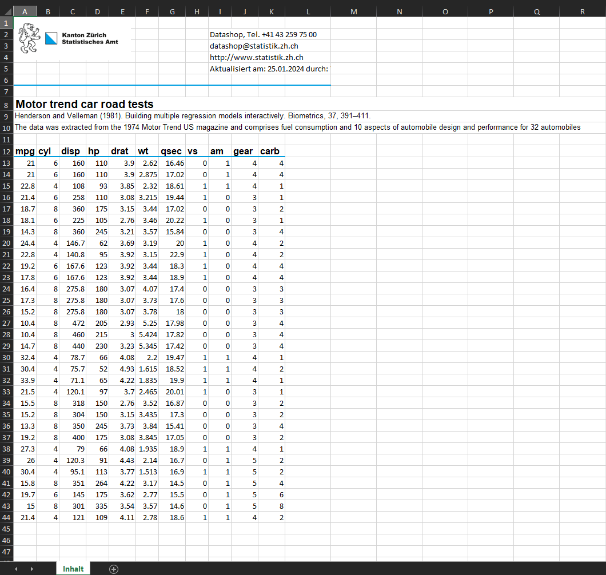
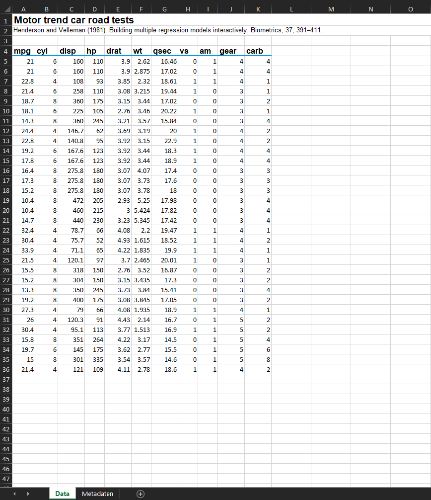
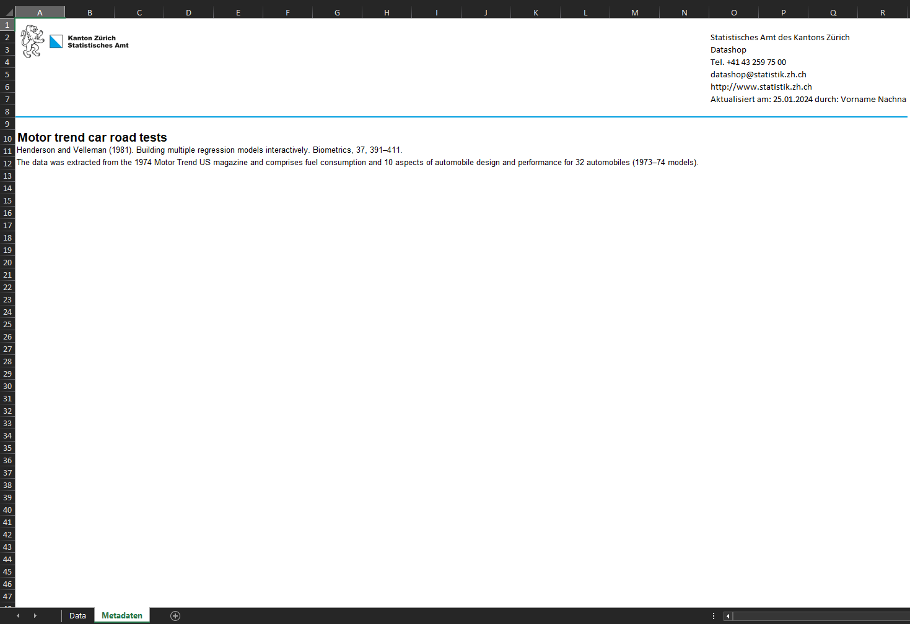
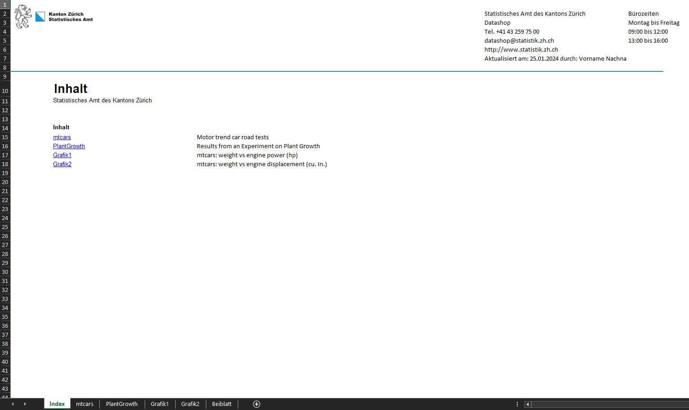
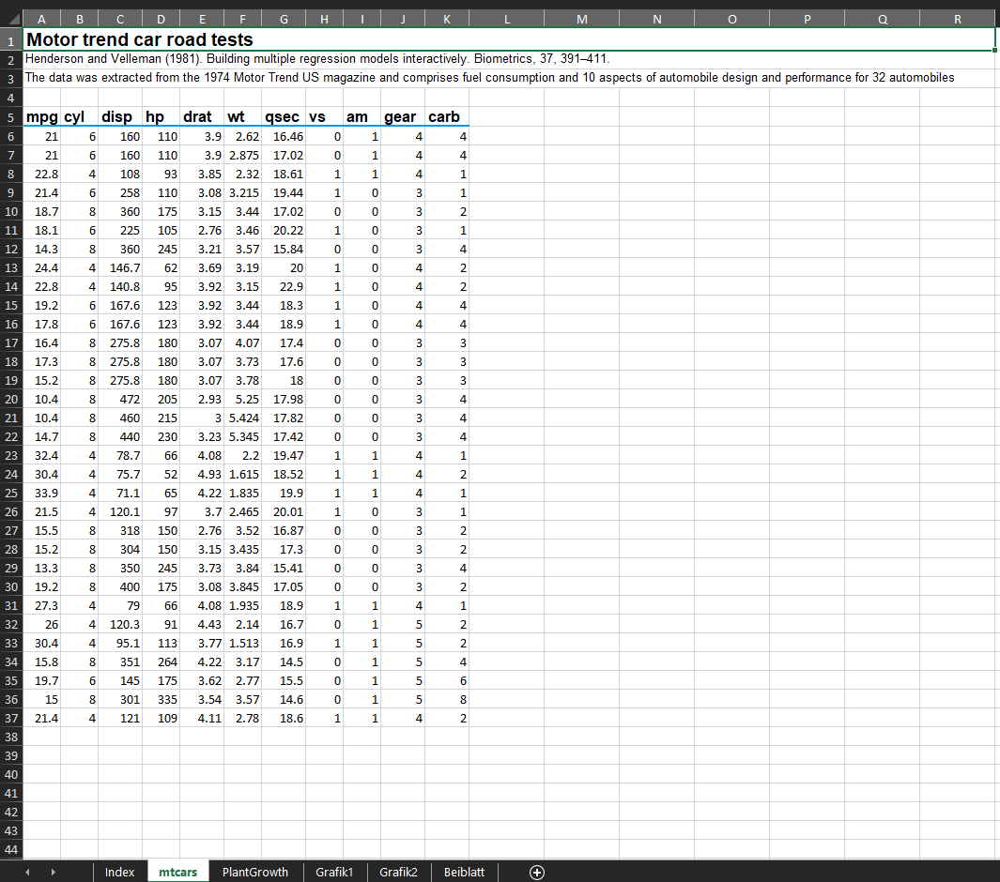
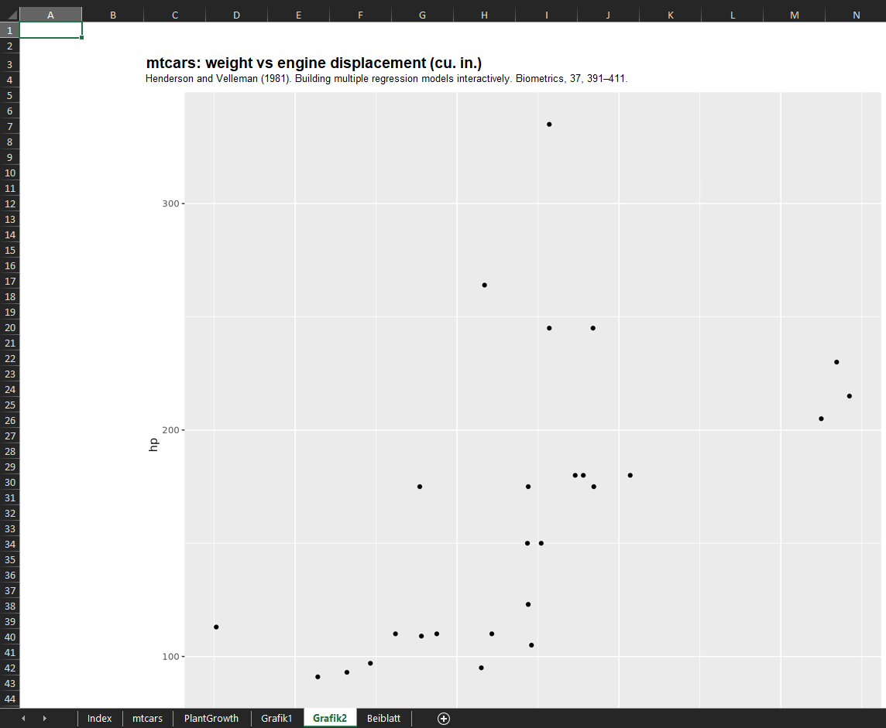
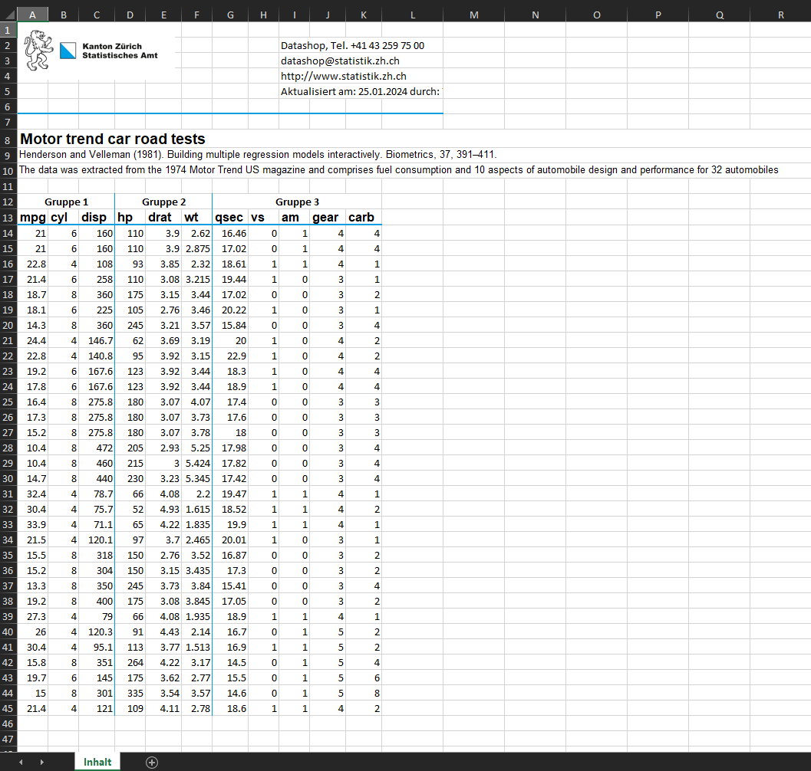
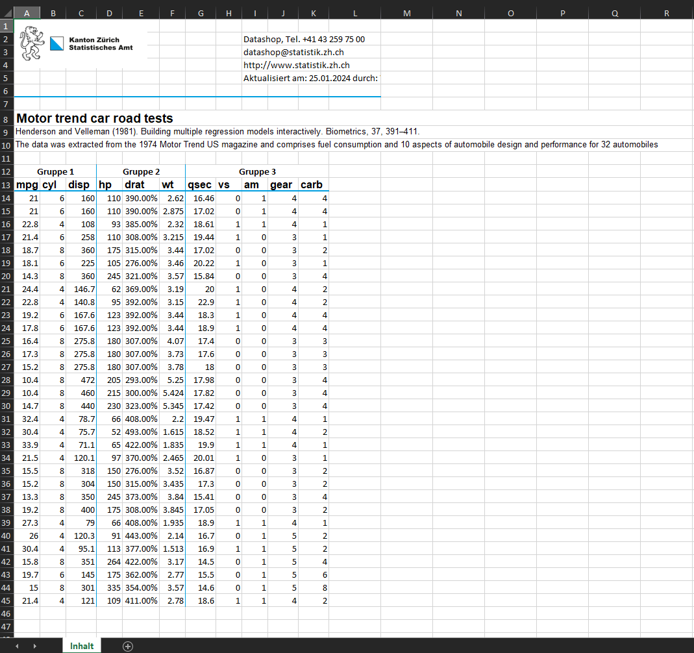

```{r, include = FALSE}
knitr::opts_chunk$set(
  collapse = TRUE,
  comment = "#>"
)

library(yaml)
library(statR)
library(dplyr)
library(ggplot2)
```

## Allgemeine Informationen

Das `statR` Package enthält Funktionen zur schnellen Erzeugung von Microsoft Excel-Dateien mithilfe des [openxlsx](https://github.com/awalker89/openxlsx) Pakets. Die Voreinstellungen orientieren sich am Corporate Design vom Statistischen Amt Kanton Zürich, Anwender können diese Voreinstellungen aber auch an ihre Bedürfnisse anpassen. Entweder, indem sie Anpassungen in den Eingabeargumenten der Funktionen vornehmen, oder indem sie eine eigene Konfiguration anlegen.

Diese Vignette bietet einen Überblick der wichtigsten Funktionen in diesem Paket sowie einen Leitfaden zur Handhabung von Nutzerkonfigurationen.


## Funktionen und Beispiele

### quickXLSX
Die Funktion \code{quickXLSX} bietet die einfachste Möglichkeit, in R eine Excel-Datei mit einem Datensatz zu erzeugen. Die Output-Datei besteht aus einem einzelnen Arbeitsblatt mit einem Header für ein Logo, Kontaktangaben, Titel, Quelle und Metadaten.

```{r, echo = TRUE, eval = FALSE}
mtcars_title <- "Motor trend car road tests"
mtcars_source <- paste0("Henderson and Velleman (1981). Building multiple ",
                        "regression models interactively. ",
                        "Biometrics, 37, 391–411.")
mtcars_metadata <- paste0("The data was extracted from the 1974 Motor Trend ",
                          "US magazine and comprises fuel consumption and ",
                          "10 aspects of automobile design and performance ",
                          "for 32 automobiles (1973–74 models).")

# Wenn logo, contactdetails und homepage NA sind, werden die Werte aus der 
# Nutzerkonfiguration verwendet
quickXLSX(data = mtcars, 
          file = "output/quickxlsx_demo",
          title = mtcars_title, 
          source = mtcars_source,
          metadata = mtcars_metadata,
          grouplines = NULL, 
          group_names = NULL,
          logo = NA,
          contactdetails = NA,
          homepage = NA,
          author = "Vorname Nachname",
          config = "default")
```

{width=95%}

### aXLSX
Mit der Funktion \code{aXLSX} kann ein einzelner Datensatz aus `R` als vorformatierte XLSX-Datei exportiert werden. Die Funktion hat zum Ziel, möglichst __barrierefreie__ Excel-Tabellen zu erstellen, die sich auch für die Publikation auf [zh.ch](zh.ch) eignen (siehe: https://statistikzh.github.io/axguide/grafiken.html#components). Dazu werden Daten und Metadateninformationen in separate Arbeitsblätter abgefüllt. Das erste Arbeitsblatt beinhaltet einen Titel, eine Quellenangabe und die Daten, das zweite Arbeitsblatt Hinweise zu den Daten sowie Kontaktinformationen. Mit dem Argument `author` kann vermerkt werden, wer die Datei erstellt hat. Der Default-Wert "user" bedeutet, dass die letzten zwei Zeichen des Computerusernamens verwendet werden. Im Argument können aber auch Vollnamen angegeben werden.

```{r, echo = TRUE, eval = FALSE}
mtcars_title <- "Motor trend car road tests"
mtcars_source <- paste0("Henderson and Velleman (1981). Building multiple ",
                        "regression models interactively. ",
                        "Biometrics, 37, 391–411.")
mtcars_metadata <- paste0("The data was extracted from the 1974 Motor Trend ",
                          "US magazine and comprises fuel consumption and ",
                          "10 aspects of automobile design and performance ",
                          "for 32 automobiles (1973–74 models).")
aXLSX(data = mtcars,
      file = "output/axlsx_demo",
      title = mtcars_title,
      source = mtcars_source,
      metadata = mtcars_metadata,
      author = "Vorname Nachname",
      config = "default")
```

{width=95%}

{width=95%}


### splitXLSX

Mit der Funktion \code{splitXLSX} lässt sich ein beliebiger Datensatz anhand eines Merkmals auf mehrere Arbeitsblätter verteilen. Zur Vereinfachung der Navigation wird im ersten Arbeitsblatt ein Inhaltsverzeichnis mit Hyperlinks angelegt. Die Funktion ist besonders geeignet in Fällen, wenn die Variable eine begrenzte Anzahl von Ausprägungen mit intuitiven Bedeutungen hat (zB. Altersklassen, Jahre oder Regionen).

Implizit wird angenommen, dass die Quellangaben und Metadaten für jede der Ausprägungen gelten. Andernfalls sollte die Funktion \code{datasetsXLSX} verwendet werden.

Im folgenden Beispiel wird aus dem \code{mtcars} Datensatz eine Arbeitsmappe erstellt, in der die Datenpunkte entsprechend der Anzahl von Zylindern auf mehrere Arbeitsblätter aufgeteilt werden.
```{r,echo = TRUE, eval = FALSE}
splitXLSX(data = mtcars,
          file = "output/splitxlsx_demo",
          sheetvar = "cyl",
          title = mtcars_title,
          source = mtcars_source,
          metadata = mtcars_metadata,
          author = "Vorname Nachname",
          config = "default"
)
```


### datasetsXLSX

Die Funktion \code{datasetsXLSX} ermöglicht die Erzeugung komplexerer Arbeitsmappen mit mehreren Datensätzen sowie die Einbindung von Grafiken (\code{ggplot}-Objekte oder Pfadangaben zu Bild-Dateien). Die Datensätze und Grafiken werden dabei als Liste im Funktionsargument \code{datasets} übergeben. Jeder Eintrag wird in ein neues Arbeitsblatt exportiert und kann wahlweise mit Titeln, Quellangaben und Metadaten versehen werden. Wie in \code{splitXLSX} wird ein Deckblatt mit einem Inhaltsverzeichnis erzeugt. Ferner besteht die Möglichkeit, mit dem Argument \code{metadata_sheet} ein Beiblatt zu erzeugen.

Das folgende Beispiel demonstriert diese Funktionsweisen:
```{r datasetsXLSX_ex1, echo = TRUE, eval = FALSE}
# --- mtcars ---
mtcars_dataset <- mtcars

# --- PlantGrowth ---
PlantGrowth_dataset <- PlantGrowth
PlantGrowth_title <- "Results from an Experiment on Plant Growth"
PlantGrowth_source <- paste0(
  "Dobson, A. J. (1983) An Introduction to Statistical ",
  "Modelling. London: Chapman and Hall.")
PlantGrowth_metadata <- c(
  "A data frame of 30 cases on 2 variables.",
  "[, 1] weight numeric",
  "[, 2] group factor",
  "",
  "The levels of group are ‘ctrl’, ‘trt1’, and ‘trt2’."
)

# --- grafik1 ---
grafik1 <- ggplot2::ggplot(mtcars, ggplot2::aes(x = wt, y = hp)) + 
  ggplot2::geom_point()
grafik1_title <- "mtcars: weight vs engine power (hp)"
grafik1_source <- mtcars_source

# --- grafik2 ---
grafik2 <- ggplot2::ggplot(mtcars, ggplot2::aes(x = wt, y = disp)) + 
  ggplot2::geom_point()
grafik2_title <- "mtcars: weight vs engine displacement (cu. in.)"
grafik2_source <- mtcars_source

# --- Beiblatt ---
beiblatt <- list(
  title = "Überschrift des Beiblatts",
  source = "Quelle",
  metadata = "Platzhalter für den Inhalt des Beiblatts"
)

# --- Export .xlsx ---
datasetsXLSX(
  file = "output/datasetsXLSX_demo1.xlsx",
  datasets = list(mtcars_dataset, PlantGrowth_dataset, grafik1, grafik2),
  sheetname = list("mtcars", "PlantGrowth", "Grafik1", "Grafik2"),
  title = list(mtcars_title, PlantGrowth_title, grafik1_title, grafik2_title),
  source = list(mtcars_source, PlantGrowth_source, grafik1_source, grafik2_source),
  metadata = list(mtcars_metadata, PlantGrowth_metadata, NULL, NULL),
  grouplines = NULL,
  group_names = NULL,
  plot_width = 10,
  plot_height = list(10, 5),
  auftrag_id = NULL,
  author = "Vorname Nachname",
  metadata_sheet = beiblatt,
  overwrite = TRUE,
  config = "default")
```

Das Beispiel weist aus Illustrationsgründen zwei Besonderheiten auf. 

* Im Argument \code{metadata} sind zwei Einträge NULL, was einer Leerlassung entspricht.
* Im Argument \code{plot_width} wird nur ein Wert angegeben, im Argument \code{plot_height} hingegen Werte für beide Grafiken. Wird nur ein Wert angegeben, so  wird dieser für alle Grafiken verwendet. 

Wie der Beispielcode suggeriert, kann ein komplexer \code{datasetsXLSX}-Aufruf unübersichtlich werden und Änderungen in der Reihenfolge der Datensätze erfordern zugleich Anpassungen bei allen übrigen Eingaben. 

Die Funktionen der  \code{add_attribute}-Familie bieten eine alternativen Weg, \code{datasetsXLSX} zu parametrisieren. Jedes Eingabeobjekt (sowohl Daten als auch Grafiken) kann mit Titel, Quellangabe, Metadaten und mehr ausgestattet werden. Das so augmentierte Objekt kann direkt in \code{datasetsXLSX} verwendet werden. Die Argumente \code{title}, \code{source}, \code{metadata} etc. können bei NULL belassen werden:

```{r datasetsXLSX_ex3, echo = TRUE, eval = FALSE}
# --- mtcars ---
mtcars_dataset <- mtcars |>
  add_sheetname("mtcars") |> 
  add_title(mtcars_title) |>
  add_source(mtcars_source) |>
  add_metadata(mtcars_metadata)

PlantGrowth_dataset <- PlantGrowth |>
  add_sheetname("PlantGrowth") |> 
  add_title(PlantGrowth_title) |>
  add_source(PlantGrowth_source) |>
  add_metadata(PlantGrowth_metadata)

# --- grafik1 ---
grafik1 <- grafik1 |>
  add_sheetname("Grafik1") |>
  add_title("mtcars: weight vs engine power (hp)") |>
  add_source(mtcars_source) |>
  add_plot_size(c(10, 10))

# --- grafik2 ---
grafik2 <- grafik2 |>
  add_sheetname("Grafik2") |>
  add_title("mtcars: weight vs engine displacement (cu. in.)") |>
  add_source(mtcars_source) 

# --- Export .xlsx ---
datasetsXLSX(
  file = "output/datasetsXLSX_demo2.xlsx",
  datasets = list(mtcars_dataset, PlantGrowth_dataset, grafik1, grafik2),
  author = "Vorname Nachname",
  metadata_sheet = beiblatt,
  overwrite = TRUE,
  config = "default")

```


{width=95%}

{width=95%}

{width=95%}


## Ausgewählte Themen

### Benutzerkonfigurationen
Um das Paket einem breiteren Anwenderkreis zugänglich zu machen, wurden diverse Textelemente im Design parametrisiert. Eingaben, die nicht NA sind, werden priorisiert. Werden Argumente zu Textelementen wie Kontaktinformationen aber bei NA belassen, werden Werte aus einer bestehenden und anpassbaren Nutzerkonfiguration substituiert. Das Paket kommt mit einer Standardkonfiguration ("default") mit dem folgendem Inhalt:

```yaml
`r xfun::file_string(system.file("extdata/config/default.yaml", package = "statR"))`
```
Basierend auf dieser Vorlage können auch weitere Konfigurationen erstellt werden. Anwendungsbeispiele: 

* Übersetzung von Textelementen in andere Sprachen
* Abteilungs-/Organisationsspezifische Kontaktinformationen

Bei der ersten Verwendung von statR wird mit der Funktion \code{initUserConfigStore} ein Verzeichnis "~/.config/R/statR" angelegt und eine Index-Datei erstellt. In dieser Datei werden der Konfigurationsname und der Pfad zur Konfigurationsdatei gespeichert. 

Neue Konfigurationen müssen zunächst mit der Funktion \code{addUserConfig} registriert werden. Das folgende Beispiel demonstriert die Vorgehensweise:

```{r, eval = FALSE}
# Laden der Konfiguration als Listenobjekt
new_config <- statR:::readUserConfig("default")

# Anpassung einzelner Eintraege
new_config$statR_config_name <- "team_data"
new_config$contactdetails$statR_name <- "Team Data"
new_config$logo$statR_logo <- "zh"

# Speichern & Registrierung der neuen Konfiguration
yaml::write_yaml(new_config, "config/team_data.yaml")
statR::addUserConfig("team_data", "config/team_data.yaml")

# Anwendung
mtcars_title <- "Motor trend car road tests"

statR::quickXLSX(data = mtcars, 
          file = "output/userconfig_demo",
          title = mtcars_title,
          source = mtcars_source,
          metadata = mtcars_metadata,
          config = "team_data",
          author = "Vorname Nachname")

```
Schliesslich besteht noch die Möglichkeit, Konfigurationen zu modifizieren (\code{updateUserConfig}) oder zu löschen (\code{removeUserConfig}).

### Einbindung von Bild-Dateien
Bilder können gegenwärtig nur mit der \code{datasetsXLSX}-Funktion eingebunden werden. Die Bildgrösse muss vom Anwender über die Argumente \code{plot_width} und \code{plot_height} definiert werden. Die folgenden Modalitäten sind zu beachten:
\itemize{
  \item{`NULL`}{ - Verwendet den Default-Wert aus der Nutzerkonfiguration}
  \item{Ein Wert}{ - Wird bei mehr als einer Grafik wiederverwendet}
  \item{Mehrere Werte}{ - Individuelles Mapping der Werte auf die Grafiken}
}

Bei \code{ggplot}-Objekten kann es sinnvoll sein, eine universale Bildgrösse zu definieren. Da \code{ggplot}-Objekte mit der angegebenen Bildgrösse in Bild-Dateien konvertiert werden, wird das Seitenverhältnis in jedem Fall eingehalten und eine unverzerrte Darstellung gewährleistet. Sofern aber auch Bild-Dateien eingebunden werden, sollten die Angaben zu \code{plot_height} und \code{plot_width} entsprechend dem ursprünglichen Seitenverhältnis definiert werden, da die Bilder andernfalls verzerrt dargestellt würden.

### Visuelle Gruppierung von Spalten
Mit dem Argument `grouplines` können in Datensätzen vertikale Linien eingefügt werden, um bestimmte Spalten visuell zu gruppieren. Dazu müssen im Argument entweder der Spaltennamen oder Spalten-Nr. der Spalten angegeben werden, bei denen eine neue Gruppe anfängt. Ferner können für diese Gruppen noch zusätzliche Überschriften erstellt werden. Dazu müssen im Argument `group_names` die Überschriftentitel angegeben werden.

```{r, eval=FALSE}
quickXLSX(data = mtcars, 
          file = "output/quickXLSX_grouped.xlsx",
          title = mtcars_title, 
          source = mtcars_source,
          metadata = mtcars_metadata,
          grouplines = c(1, 4, 7), 
          group_names = c("Gruppe 1", "Gruppe 2", "Gruppe 3"),
          author = "Vorname Nachname",
          config = "default")
```

{width=95%}

### Zeilentrennung für lange Texteingaben
Es ist ein bekanntes Problem, dass lange Texteingaben in Feldern wie `metadata` oder `source` abgeschnitten werden. Ursache dafür ist, dass Microsoft Excel für verbundene Zellen keine automatische Zeilenhöhen unterstützt (https://support.microsoft.com/en-us/topic/you-cannot-use-the-autofit-feature-for-rows-or-columns-that-contain-merged-cells-in-excel-34b54dd7-9bfc-6c8f-5ee3-2715d7db4353). Als Workaround kann man entweder die Zeilenhöhen manuell anpassen oder dem Problem vorbeugen, indem man den Text manuell auf mehrere Zeilen verteilt (e.g.: `c("Text Zeile 1, "Text Zeile 2", "Text Zeile 3")`).


### Formatierung von Spalteninhalten
Die zugrundeliegende \code{openxlsx}-Library ermöglicht es, Variablen entsprechend ihrer Einheit zu formatieren. Dafür muss der Variable eine der unterstützten Klassen  zugeordnet werden ("percentage", "hyperlink", "comma", "scientific", und mehr). Siehe dazu auch die umfangreichere \code{openxlsx}-Vignette https://cran.r-project.org/web/packages/openxlsx/vignettes/Formatting.html).

Das folgende Beispiel demonstriert den Prozess anhand des Merkmals "drat" (rear axle ratio):

```{r, eval=FALSE}
mtcars_dataset <- mtcars
class(mtcars_dataset$drat) <- "percentage"

quickXLSX(data = mtcars_dataset, 
          file = "output/quickXLSX_pct.xlsx",
          title = mtcars_title, 
          source = mtcars_source,
          metadata = mtcars_metadata,
          grouplines = c(1, 4, 7), 
          group_names = c("Gruppe 1", "Gruppe 2", "Gruppe 3"),
          author = "Vorname Nachname",
          config = "default")
```
{width=95%}

* Mit `class(data$variable1) <- "percentage"` können die Werte der `variable1` (reichen von 0 bis 1) als Prozent mit Prozentzeichen ausgegeben werden. 
* Mit `class(data$variable2) <- "hyperlink"` können Weblinks als interaktive Hyperlinks formatiert werden.
* Mit `class(data$variable3) <- "scientific"` werden Zahlen in wissenschaftlicher Notation dargestellt. 
* Mit `class(data$variable4) <- "comma"` werden Tausenderstellen visuell durch ein Apostroph getrennt (z.B. 1'000).
