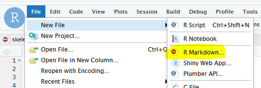

```{r, include = FALSE}
knitr::opts_chunk$set(
  collapse = TRUE,
  comment = "#>"
)
```

```{r setup}
library(statR)
```

Das statR-Package enthält ein Template für html-Berichte, die dem kantonalen Corporate Design entsprechen.  

Dieses ist in R Studio im Menü unter __'File > New File > R Markdown'__ verfügbar.



Im Auswahlfenster kann das __ZH Report__-Template ausgewählt werden. 


